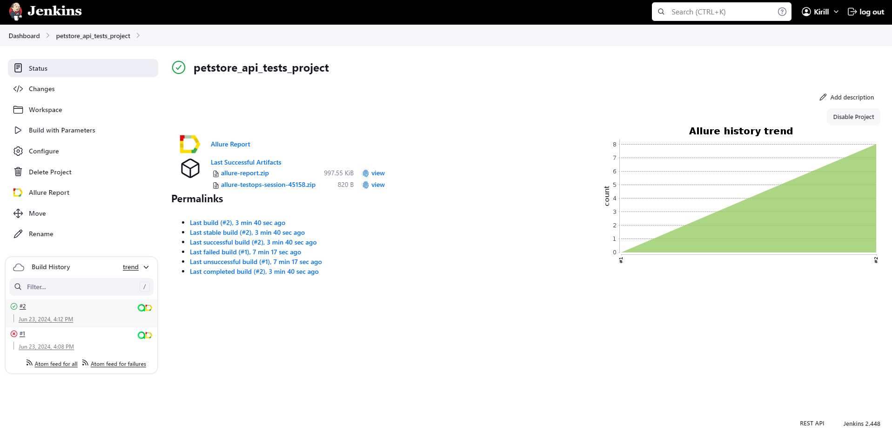
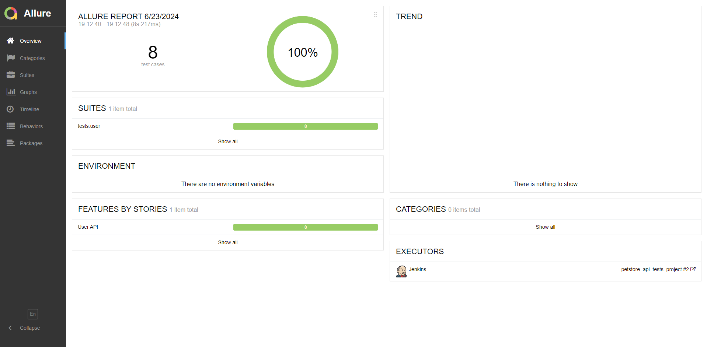
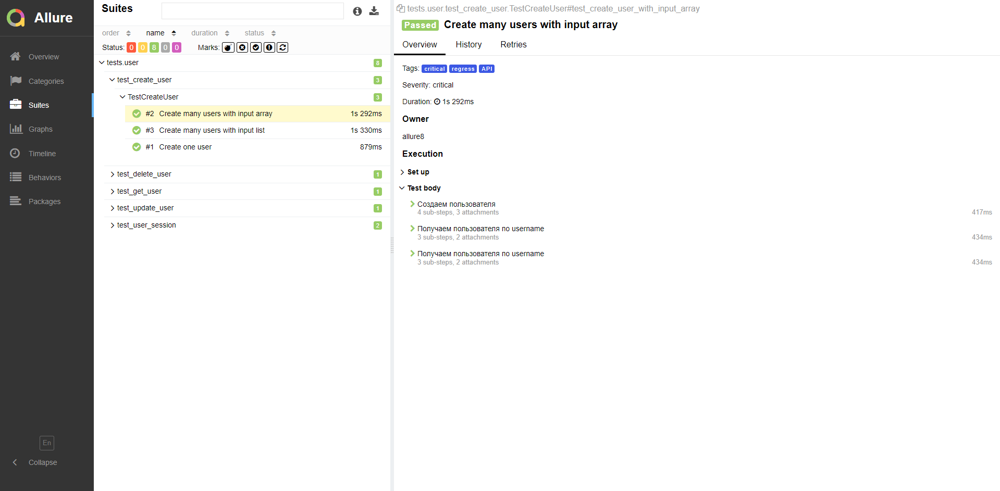
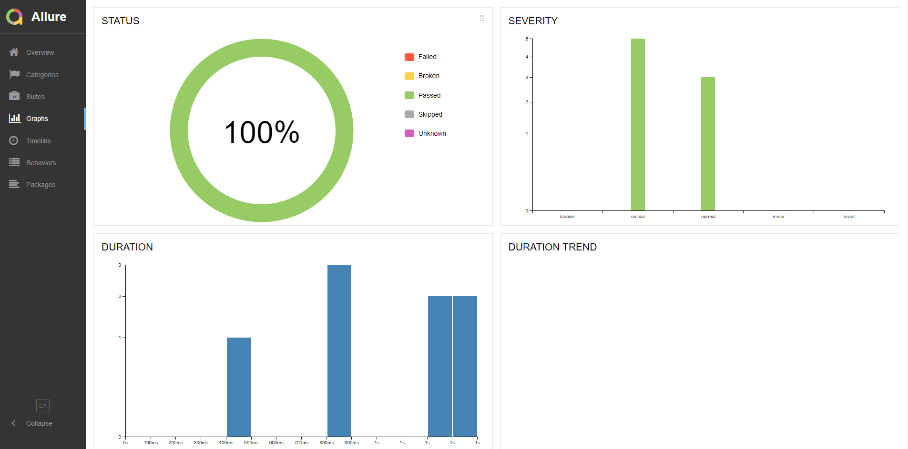
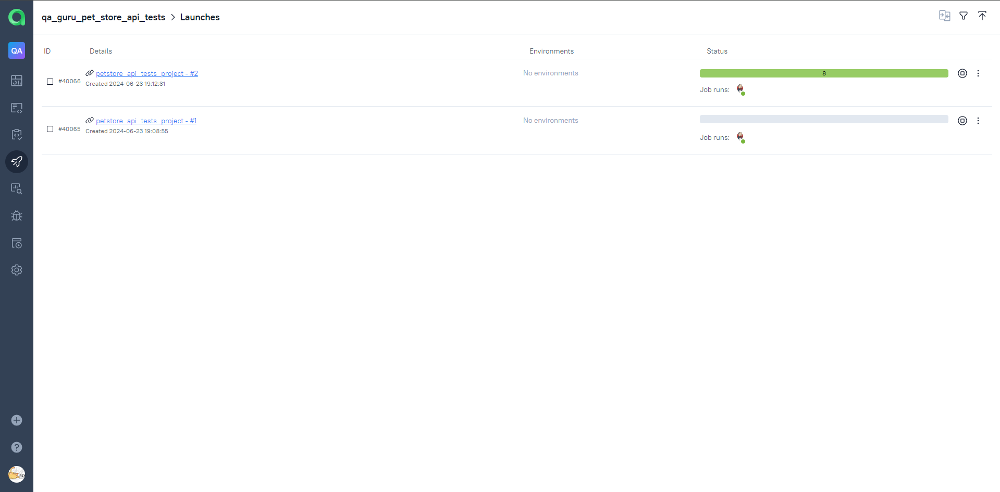
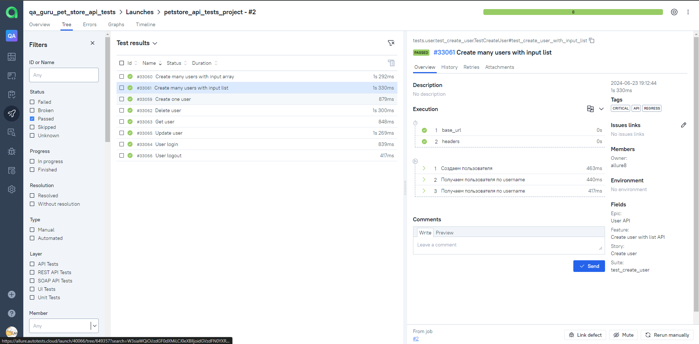
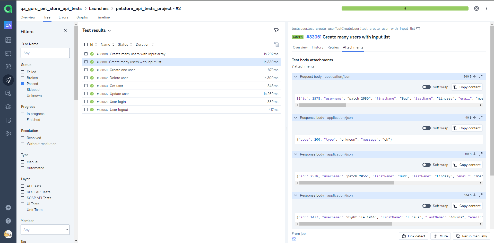
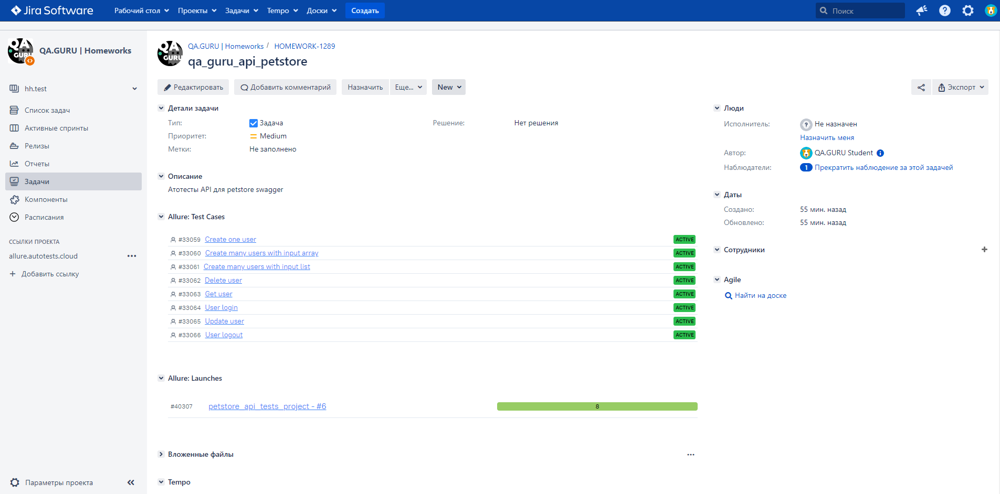
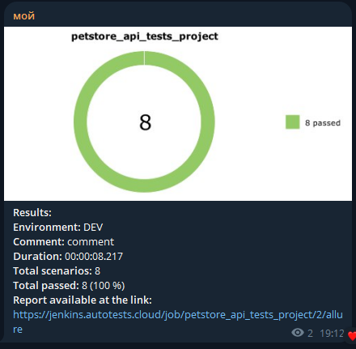

# Фреймворк для автоматизации тестирования API Petstore
> <a target="_blank" href="https://petstore.swagger.io/">petstore.swagger.io</a>


----

### Особенности проекта

* Оповещения о тестовых прогонах в Telegram
* Отчеты с request body, response body, status code
* В тестах проверяются request body, response body, status code
* В тестах присутствует валидация типов данных, как request body, так и response body
* Валидация Pydantic
* Сборка проекта в Jenkins
* Отчеты Allure Report
* Интеграция с Allure TestOps
* Генерация тестовых данных Mimesis

### Список проверок

- [x] Создать одного пользователя
- [x] Создать нескольких пользователей при помощи массива
- [x] Создать нескольких пользователей при помощи листа
- [x] Удалить пользователя
- [x] Получить пользователя по username
- [x] Обновить пользователя
- [x] Авторизоваться
- [x] Выйти из системы

----

### Используемый стэк

           

----

### Локальный запуск автотестов

#### Выполнить в cli:
```bash
python -m venv .venv
source .venv/bin/activate
pip install -r requirements.txt
pytest -s -v
```

#### Получение отчёта:
```bash
allure serve build/allure-results
```

----

### Проект в Jenkins
> <a target="_blank" href="https://jenkins.autotests.cloud/job/petstore_api_tests_project/">Ссылка</a>

#### Параметры сборки
> [!NOTE]
> Параметры сборки не обязательны
```python
ENVIRONMENT = ['DEV', 'PROD'] # Окружение
COMMENT = 'comment' # Комментарий
```
#### Запуск автотестов в Jenkins
1. Открыть <a target="_blank" href="https://jenkins.autotests.cloud/job/petstore_api_tests_project/">проект</a>



2. Нажать "Build with Parameters"
3. Из списка "ENVIRONMENT" выбрать любое окружение
4. В поле "COMMENT" ввести комментарий
5. Нажать "Build"


----

### Allure отчет
#### <a target="_blank" href="https://jenkins.autotests.cloud/job/Petstore-API-Auto-Tests/10/allure/#">Общие результаты</a>


#### <a target="_blank" href="https://jenkins.autotests.cloud/job/Petstore-API-Auto-Tests/10/allure/#suites/94c8c4ac5fc4c534c54cd08189c43b55/9ff66467c660d9c7/">Результаты прохождения теста</a>



#### <a target="_blank" href="https://jenkins.autotests.cloud/job/Petstore-API-Auto-Tests/10/allure/#graph">Графики</a>





----

### Интеграция с Allure TestOps
#### <a target="_blank" href="https://allure.autotests.cloud/project/3909/dashboards">Ссылка на проект</a>


#### <a target="_blank" href="https://allure.autotests.cloud/project/3909/launches">История запуска тестовых наборов</a>



#### <a target="_blank" href="https://allure.autotests.cloud/project/3909/test-cases/28499?treeId=0">Тест кейсы</a>



#### <a target="_blank" href="https://allure.autotests.cloud/launch/33574/tree/551304/attachments?treeId=0">Тестовые артефакты</a>




----

### Интеграция с Jira
> <a target="_blank" href="https://jira.autotests.cloud/browse/HOMEWORK-1289">Ссылка на проект</a>


----

### Оповещения в Telegram


----
